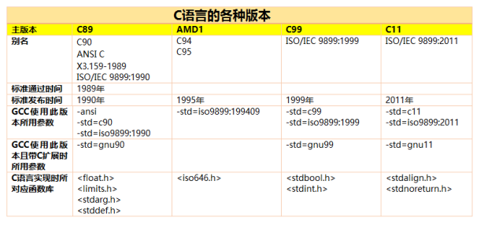
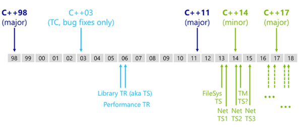
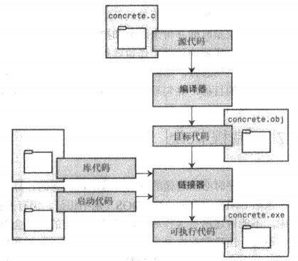

# 语言版本
相关描述文件可以在ISO官方页面查看：http://open-std.org/
C语言：http://open-std.org/JTC1/SC22/WG14/
ANSI C Rationale：http://www.lysator.liu.se/c/rat/title.html
GNU C Reference Manual：https://www.gnu.org/software/gnu-c-manual/gnu-c-manual.html
C++语言：http://open-std.org/JTC1/SC22/WG21/

**C版本**

在C89之前的C语言被称为传统C
现在C99是C语言的官方标准
当前GCC编译C的默认参数是`-std=gnu90`，包含一些GNU自己的修改
VC编译器并不完全支持C99

从传统C到C89的修改包括：
* 添加了真正的标准函数库
* 新的预处理器命令和特性
* 函数原型，允许程序员在函数声明中指定参数的类型
* 增加了一些新的关键字，包括const、volatile和signed
* 宽字符、宽字符串和多字节字符
* 在转换规则、声明和类型检查方面的许多小改动和澄清

从C89到C95的修改包括：
* 3个新的标准库头文件：iso646.h、wctype.h和wchar.h
* 几个新的标记和宏，用于替换有些国家的字符集中不存在的操作符和标点符号
* printf/scanf函数家族的一些新的格式代码
* 大量用于多字节字符和宽字符的新函数以及一些类型和常量

从C95到C99的修改包括：
* 复数运算
* 整数类型的扩展，包括更长的标准类型
* 可变长度的数组
* 布尔类型
* 对非英语字符集提供了更好的支持
* 对浮点类型提供了更好的支持，包括所有类型的数学函数
* C++风格的注释（//）

**C++版本**

C++版本最新状态：https://isocpp.org/std/status

**C和C++差异**
标准C++几乎但不完全是标准C的超集

**Clean C**
标准C和标准C++的公共子集常被称为Clean C。使用Clean C需要注意：
* 必须使用函数原型
* 必须避免使用C++关键字作标识符

# 概述
**C的特征**
* C程序很紧凑，程序更小
* 运行速度快
* 提供非常接近硬件的操作能力
* 源代码的可移植性强，即使修改也只需修改头文件中几项内容，但为访问特定硬件设备的代码是不可移植的

C语言本身不提供控制台输入输出、文件操作、动态内存管理等语句，通过扩充的标准C链接库提供。标准C链接库在各个系统中有不同的底层实现，但接口相同。

**语法构成**
C的语法构成包含：注释、预处理器指令、main、函数、语句、表达式、变量、常量、数据类型、操作符、函数库

# 编译链接

目标代码文件的内容一般是对应的机器语言代码
不同的操作系统使用不同的启动代码
链接器就是将目标代码、启动代码和库代码结合在一起，并存在单个文件中，即可执行文件

Unix上的编译器成为cc
Linux是gcc

一个C程序（除例外情况）总是从main函数开始执行

# 注释
C90只有（多行）注释，C99才增加了单行注释
* （多行）注释可以放在任何可以出现空白符的地方。任何在多行注释内的内容都会被编译器忽略
* 单行注释被限制在一行，直到该行结束的内容都被当作注释
```c
/* 注释
*/
int main(){     // 单行注释
    int /* 注释可以出现在任意位置*/ i = 2 + 3;
}
```
# 标识符
标识符可以包含大小写字母、数字和下划线(_)，区分大小写，第一个字符必须是字母或下划线。

C90要求标识符最多可以有31个字符，外部标识符最多6个。更旧的编译器最多只允许8个字符
C99要求最多可以有63个字符，外部标识符31个。C99通过UCN提供对扩展字符集的支持
如果超过规定的最大值，编译器不会报错，但也不会识别额外的字符

标识符不能是C语言的关键字，这会触发语法错误。也不能是保留标识符(reserved identifier)，即C语言已使用或保留使用的标识符，包括以下划线开始的标识符和标准库函数的名字。

操作系统和C库通常用一个或两个下划线的标识符命令函数或变量。

C语言关键字：
 
* void, unsigned, signed, char, short, int, long, float, double, (C99)_Bool, (C99)_Complex, (C99)_Imaginary
* const, static, auto, extern, register, volatile, (C99)restrict
* enum, struct, union
* if, else, switch, case, default, for, do, while, break, continue, goto, return  
* sizeof, typedef, (C99)inline

# 预处理器
## 宏定义
do{...}while(0) 宏定义
使用do{...}while(0)构造后的宏定义完全等价于一条语句，不会受到大括号、分号等的影响，总是会按你期望的方式调用运行。另外，通过使用break和do...while(0)还能消除goto语句。使用空的do{}while(0)能定义一个空宏，避免编译警告。
比如：
```c
#define foo(x) bar(x); baz(x)
if(true)
  foo(x); # 逻辑错误，实际只有第一个语句在if语句中

#define foo(x)  { bar(x); baz(x); }
if(true)
  foo(x); # 语法错误，大括号后有分号';' 
else
  bin(x);

#define foo(x)  do{ bar(x); baz(x); }while(0)
if(true)
  foo(x); # 正确
else
  bin(x);
```

# main函数
每个C程序都必须定义main函数，main函数是程序开始执行时的第一个函数，main函数内部可以再调用其他函数。

main函数的标准形式是
```c
int main(void)
int main()
```
对其他形式，编译器不必支持，所以最好不要使用。如：
```c
main()
void main()
```
# 变量
所有变量都必须在使用之前先定义
传统上，C语言要求在代码块开始出声明变量，在这之前不允许任何其他语句。C99遵循C++的惯例，允许声明出现在代码块的任何位置

变量声明
```c
int n; int m;       // 可以每条语句声明一个变量
int n, m;           // 一条语句可以声明多个变量
int n = 1, m = 2;   // 声明时可以初始化
int n = m = 2;      // 错误。只声明了n，没有申明m。相当于 m=2; int n=m;
```
# 常量
C程序中，直接写在代码中的数据称为常量，包括整数常量和浮点数常量

整数常量可以为十进制、八进制、十六进制

# 数据类型
C提供的数据类型分两大类：整数类型和浮点数类型
* 整数和浮点数的内存存储方案不同
* 浮点数并不能精确的表示值，但整数能精确表示值
* 浮点运算通常比整数运算慢。专门的浮点运算单元可以减少速度差异

整数类型：
* signed/unsigned/long/short int
* char

浮点数类型：
* float
* double
* long double

其他：
* _Bool
* _Complex
* _Imaginary

# 标准C函数库
C语言实现时对应的函数库：
float.h、iso646.h(C95)、limits.h、stdarg.h、stdbool.h(C99)、stddef.h、stdint.h(C99)

# IO

